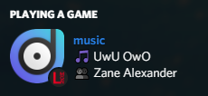
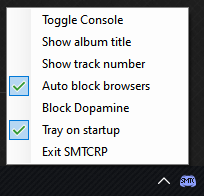

# SMTC Rich Presence

Rich presence for all SMTC apps, a.k.a. the ones that show up when you change the volume.

## Features

- It shows what music you're listening to from any app

- You can block certain apps as you please

- It has a cool context menu I guess

## Tested with
(these are the apps that SMTCRP is proven to work with, and has special icons for. As long as your media shows up when you adjust your volume in that obnoxiously large volume thing (can you tell I daily a Mac?), it should work.)

- [x] [Groove Music](https://www.microsoft.com/en-gb/p/groove-music/9wzdncrfj3pt)

- [x] [Dopamine](https://www.digimezzo.com/software/dopamine/)

- [x] [WACUP](https://getwacup.com/) (with `gen_win10shell.dll` plugin)

- [x] [TIDAL](https://tidal.com/) 

## Setup

1. Download a [release](https://github.com/thelmgn/smtcrp/releases)

2. Launch the exe.

3. There is no step 3.

## Note about browsers

By default, this app will **IGNORE** any apps starting with `discord`, `firefox`, `chrom`, `msedge` or `opera`. You can disable this if you'd like, but their presences will likely never be supported.
